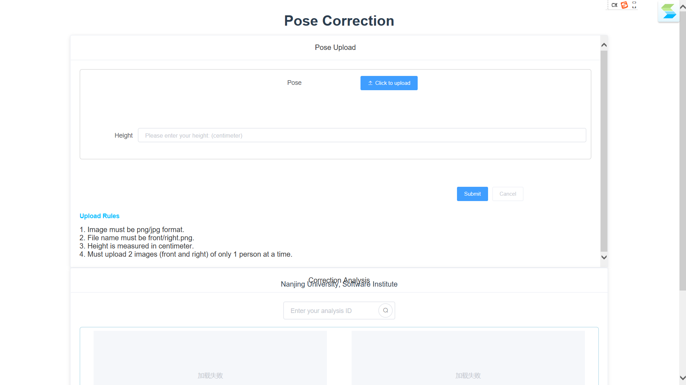
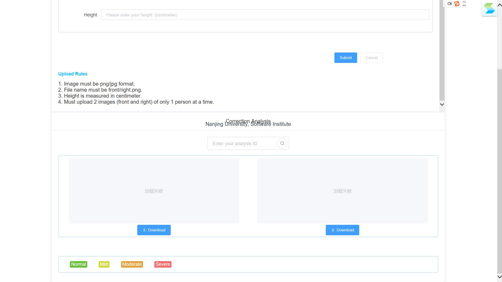
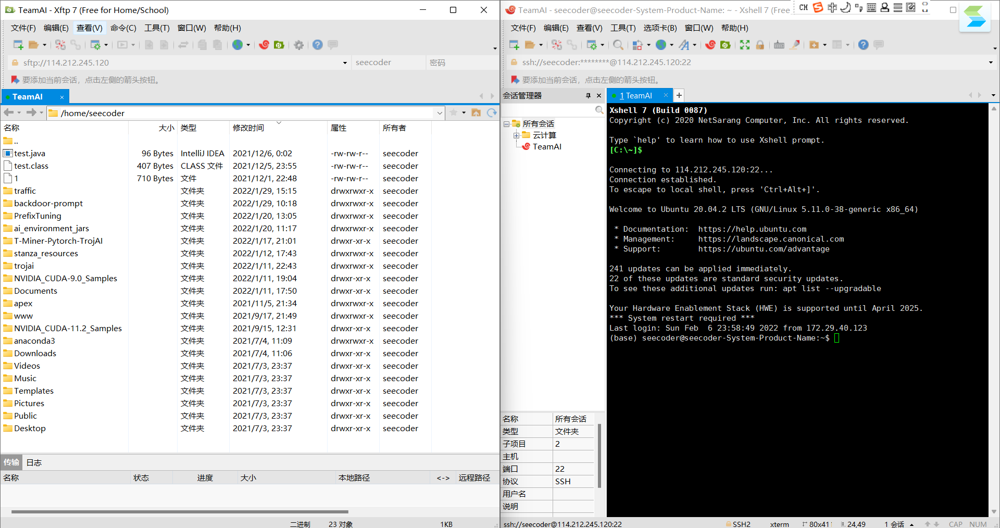
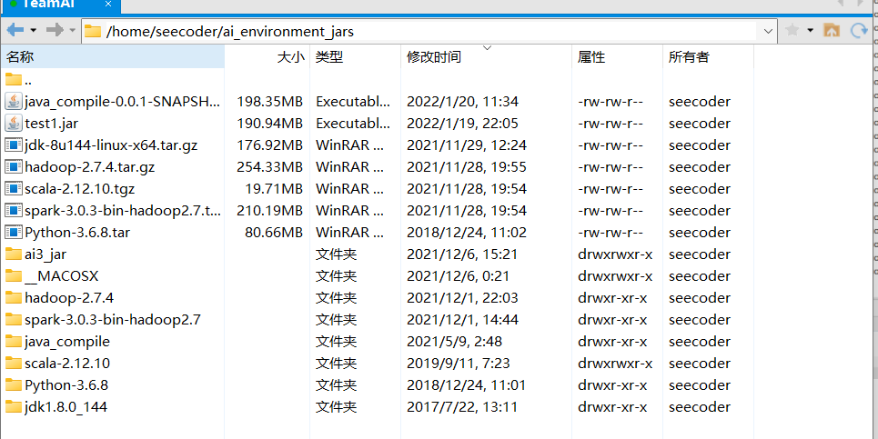
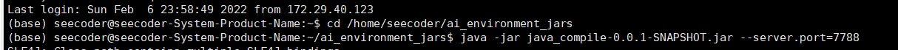
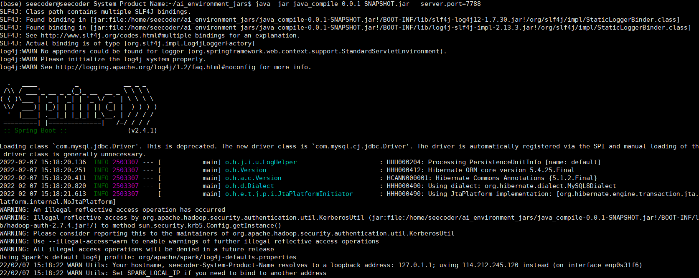

## 1.服务器地址：

114.212.245.120

### 目前的前端页面：

> 
>
> 


## 2.访问服务器需要南大VPN


## 3.账户名和密码

服务器账户名和密码都是seecoder，root账户的密码也是seecoder。


## 4.运行java后端方法

### 4.1 启动南大VPN，连接服务器

> 


### 4.2 进入目录

/home/seecoder/ai_environment_jars

> 


### 4.3 启动java后端



```bash
cd /home/seecoder/ai_environment_jars #cd命令进入对应目录

java -jar [jar包名称] --server.port=[端口号]  #端口号可以用7788，文件夹里的jar包有test1.jar和java_compile-0.0.1这个，后面这个就是打包后的java后端。
```


### 4.4 启动成功

启动成功，显示如下画面：

> 